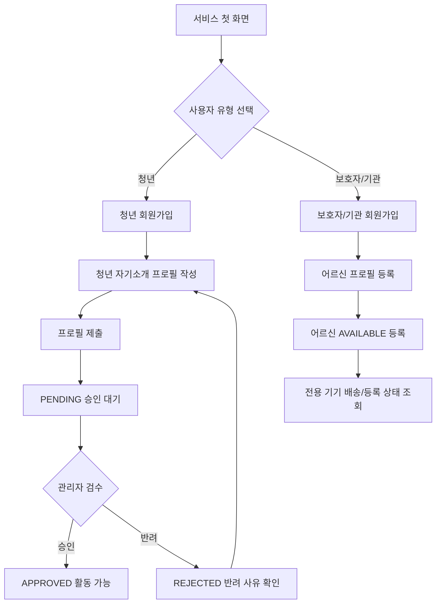
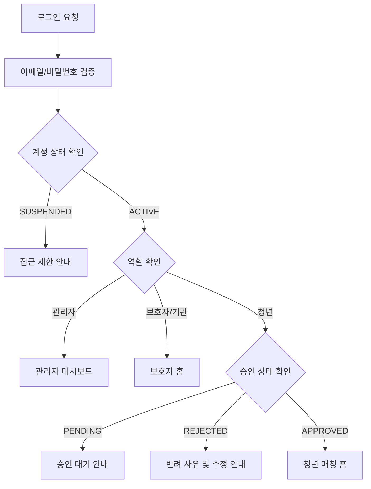
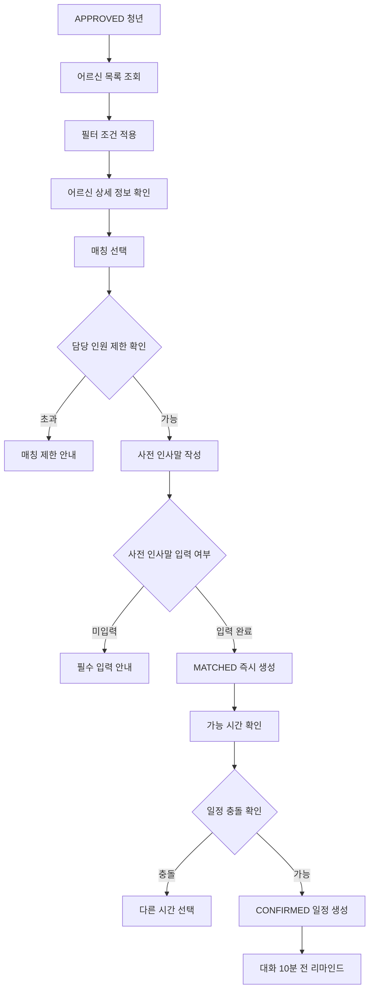
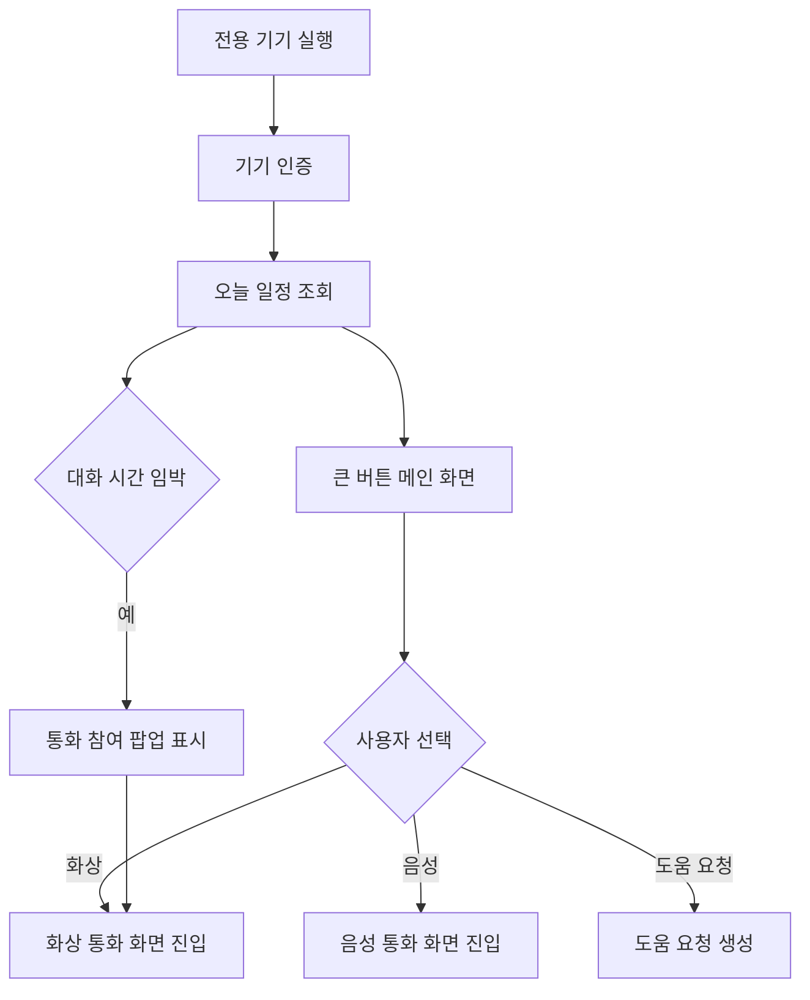
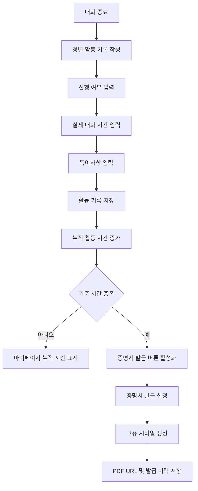
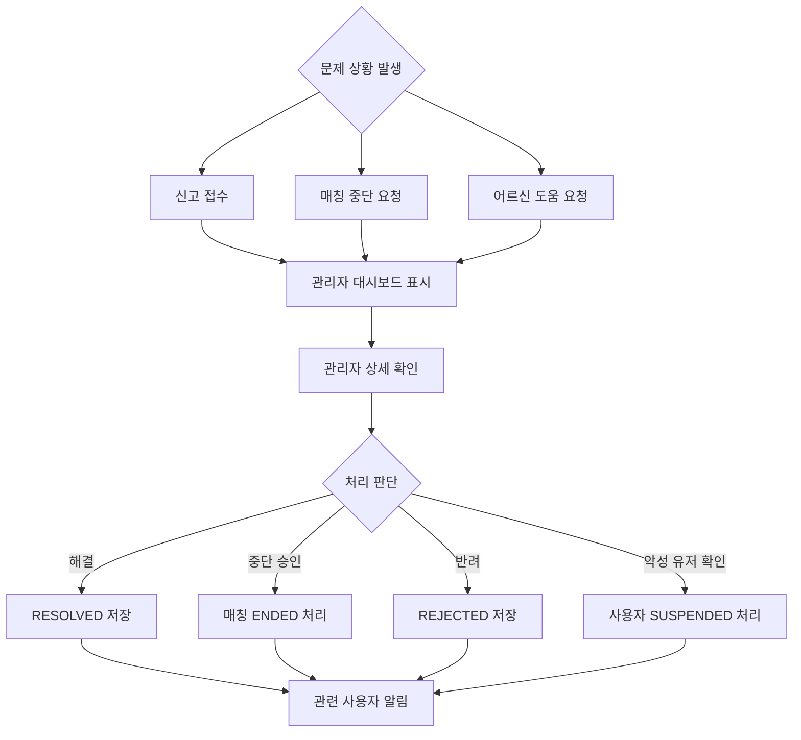
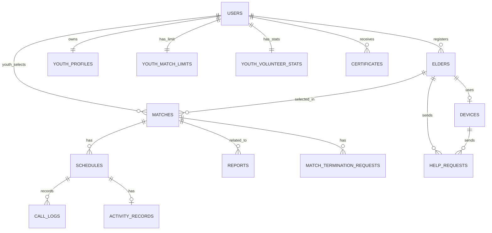

## 3. 유저 스토리

### 3.1 사용자 계정 / 인증

| ID | 사용자 | 유저 스토리 | 인수 조건 | 우선순위 |
| --- | --- | --- | --- | --- |
| US-01 | 청년 | 청년은 말동무 활동을 시작하기 위해 청년 계정으로 회원가입할 수 있다. | 청년 유형을 선택하여 가입을 완료하면 계정이 생성되고 승인 대기 상태가 부여된다. | MVP |
| US-02 | 보호자/기관 | 보호자/기관은 어르신의 서비스 이용을 신청하기 위해 계정으로 회원가입할 수 있다. | 필수 정보를 입력하면 계정이 생성되고 어르신 등록 화면으로 이동한다. | MVP |
| US-03 | 사용자 | 사용자는 서비스에 접속하기 위해 이메일과 비밀번호로 로그인할 수 있다. | 로그인 시 계정 상태와 청년 승인 상태를 검증하여 `PENDING`, `REJECTED`, `SUSPENDED` 상태는 제한 안내를 표시한다. | MVP |
| US-04 | 청년/보호자 | 사용자는 가입 부담을 줄이기 위해 SNS 간편 로그인으로 접속할 수 있다. | 카카오, 네이버, 구글 인증 완료 시 계정이 생성되거나 연동된다. | 후순위 |
| US-05 | 사용자 | 사용자는 비밀번호를 잊었을 때 재설정할 수 있다. | 이메일 또는 휴대폰 번호로 재설정 안내가 제공된다. | 후순위 |

### 3.2 청년 프로필

| ID | 사용자 | 유저 스토리 | 인수 조건 | 우선순위 |
| --- | --- | --- | --- | --- |
| US-06 | 청년 | 청년은 말동무 활동을 준비하기 위해 자기소개 프로필을 작성하고 제출할 수 있다. | 프로필 사진, 키워드, 인사말을 작성해 제출하면 관리자에게 승인 대기 상태로 전달된다. | MVP |
| US-07 | 청년 | 청년은 자신의 성향을 표현하기 위해 키워드를 선택할 수 있다. | 키워드는 최대 개수 제한 내에서 선택 가능하며 경쟁 지표로 쓰이지 않는다. | MVP |
| US-08 | 청년 | 청년은 어르신에게 편안한 첫인상을 주기 위해 한 줄 인사말을 작성할 수 있다. | 글자 수 제한과 금칙어 검사를 통과하면 저장된다. | MVP |
| US-09 | 청년 | 청년은 필요할 경우 목소리 샘플을 등록할 수 있다. | 녹음 파일이 정상 저장되며 무음 또는 오류 파일은 제한된다. | 후순위 |

### 3.3 어르신 정보 등록 및 기기 관리

| ID | 사용자 | 유저 스토리 | 인수 조건 | 우선순위 |
| --- | --- | --- | --- | --- |
| US-10 | 보호자/기관 | 보호자/기관은 어르신이 서비스를 이용할 수 있도록 어르신 정보를 등록할 수 있다. | 이름, 연령대, 배송 주소, 관심사, 대화 가능 시간, 요청 사항을 입력하면 저장된다. | MVP |
| US-11 | 보호자/기관 | 보호자/기관은 어르신의 대화 조건이 바뀌었을 때 정보를 수정할 수 있다. | 관심사, 대화 방식, 활동 난이도 등을 수정하면 변경 내용이 저장된다. | MVP |
| US-12 | 보호자/기관 | 보호자/기관은 자신이 등록한 어르신 목록을 확인할 수 있다. | 등록한 어르신 목록과 현재 매칭 상태가 표시된다. | MVP |
| US-13 | 보호자/기관 | 보호자/기관은 어르신 전용 기기 제공 상태를 확인할 수 있다. | 정보 등록이 완료되면 기기 배송 및 등록 상태를 확인할 수 있다. | MVP |

### 3.4 청년 선택형 즉시 매칭

| ID | 사용자 | 유저 스토리 | 인수 조건 | 우선순위 |
| --- | --- | --- | --- | --- |
| US-14 | 청년 | 청년은 자신에게 맞는 말동무 활동을 찾기 위해 등록된 어르신 목록을 조회할 수 있다. | 관심사, 대화 방식, 활동 난이도 등으로 필터링하여 목록을 볼 수 있다. | MVP |
| US-15 | 청년 | 청년은 매칭 전에 어르신의 상세 대화 조건을 확인할 수 있다. | 연령대, 관심사, 가능 시간, 대화 방식, 보호자 요청 사항이 표시된다. | MVP |
| US-16 | 청년 | 청년은 어르신을 선택하고 첫인사말을 작성하여 즉시 매칭을 확정할 수 있다. | 사전 인사말을 입력하고 완료하면 수락 대기 없이 즉시 `MATCHED` 상태가 된다. | MVP |
| US-17 | 청년 | 청년은 과도한 부담을 피하기 위해 현재 담당 인원 수를 확인할 수 있다. | 최대 담당 가능 인원 초과 시 추가 매칭 생성이 제한된다. | MVP |
| US-18 | 보호자/기관 | 보호자/기관은 어르신이 어떤 매칭 상태에 있는지 기본 정보만 확인할 수 있다. | 청년을 직접 선택하거나 비교 평가하는 기능은 제공되지 않는다. | MVP |

### 3.5 일정 관리

| ID | 사용자 | 유저 스토리 | 인수 조건 | 우선순위 |
| --- | --- | --- | --- | --- |
| US-19 | 청년 | 청년은 말동무 활동이 가능한 시간을 달력에 등록할 수 있다. | 시작 시간과 종료 시간을 입력하면 가능 시간이 저장된다. | MVP |
| US-20 | 보호자/기관 | 보호자/기관은 어르신의 대화 가능 시간을 등록할 수 있다. | 가능한 날짜와 시간대를 입력하면 저장된다. | MVP |
| US-21 | 청년 | 청년은 매칭된 어르신과의 대화 일정을 확정하여 생성할 수 있다. | 양측의 가능 시간을 검증하여 충돌이 없으면 일정이 생성된다. | MVP |
| US-22 | 사용자 | 청년, 보호자, 어르신은 예정된 대화 일정을 확인할 수 있다. | 역할에 따라 관련 일정 목록과 일시가 표시된다. | MVP |
| US-23 | 청년/관리자 | 일정 변경이 필요한 경우 확정된 일정을 취소할 수 있다. | 취소 사유를 입력하면 일정 상태가 `CANCELED`로 변경된다. | 후순위 |
| US-24 | 사용자 | 사용자는 대화 시작 전 리마인드 알림을 받을 수 있다. | 대화 10분 전 기기로 알림이 전송된다. | 후순위 |

### 3.6 어르신 전용 기기 / 통화

| ID | 사용자 | 유저 스토리 | 인수 조건 | 우선순위 |
| --- | --- | --- | --- | --- |
| US-25 | 어르신 | 어르신은 복잡한 조작 없이 전용 태블릿에서 오늘 일정을 확인할 수 있다. | 기기 메인 화면에 오늘 대화 일정과 통화 가능 상태가 큰 글씨로 표시된다. | MVP |
| US-26 | 어르신 | 어르신은 버튼 한 번으로 청년과 화상 통화를 시작할 수 있다. | 커다란 화상 통화 버튼을 누르면 통화 화면에 진입한다. | MVP |
| US-27 | 어르신 | 어르신은 버튼 한 번으로 청년과 음성 통화를 시작할 수 있다. | 커다란 음성 통화 버튼을 누르면 통화 화면에 진입한다. | MVP |
| US-28 | 어르신 | 어르신은 대화 시간이 가까워지면 쉽게 통화에 참여할 수 있다. | 대화 임박 시 큰 통화 참여 버튼이 팝업으로 자동 표시된다. | MVP |
| US-29 | 어르신 | 어르신은 화면을 좌우로 넘겨 주요 메뉴를 전환할 수 있다. | 스와이프를 통해 화상, 음성, 도움 요청 화면을 손쉽게 전환한다. | MVP |
| US-30 | 어르신 | 어르신은 도움이 필요할 때 큰 버튼으로 도움 요청을 보낼 수 있다. | 요청이 생성되고 기기 상태 정보가 관리자에게 전송된다. | MVP |

### 3.7 활동 기록 및 증명서 발급

| ID | 사용자 | 유저 스토리 | 인수 조건 | 우선순위 |
| --- | --- | --- | --- | --- |
| US-31 | 청년 | 청년은 대화 종료 후 활동 기록을 작성하여 활동 시간을 누적할 수 있다. | 진행 여부와 실제 대화 시간(분)을 입력해 제출하면 개인 통계 시간에 즉시 합산된다. | MVP |
| US-32 | 보호자/기관 | 보호자/기관은 어르신의 대화가 실제로 진행되었는지 확인할 수 있다. | 대화 일자, 진행 여부, 기본 특이사항만 확인 가능하며 상세 평가는 불가능하다. | MVP |
| US-33 | 청년 | 청년은 누적된 활동 시간을 공식적인 사회참여 활동 증명서로 발급받을 수 있다. | 누적 시간이 기준을 충족하면 고유 일련번호가 찍힌 증명서가 발급된다. | MVP |

### 3.8 관리자 통제 / 신고 / 도움 요청

| ID | 사용자 | 유저 스토리 | 인수 조건 | 우선순위 |
| --- | --- | --- | --- | --- |
| US-34 | 관리자 | 관리자는 가입 대기 중인 청년 프로필을 검수하여 승인할 수 있다. | 승인 시 해당 청년은 매칭이 가능해지며, 반려 시 사유를 남길 수 있다. | MVP |
| US-35 | 관리자 | 관리자는 운영 정책을 위반한 악성 유저를 즉시 제재할 수 있다. | 계정을 `SUSPENDED` 처리하면 해당 유저의 모든 로그인이 막힌다. | MVP |
| US-36 | 청년/보호자/어르신 | 사용자는 대화 중 불편한 상황이 발생하면 신고할 수 있다. | 신고 내용을 입력하면 `PENDING` 상태로 관리자에게 전달된다. | MVP |
| US-37 | 청년/보호자 | 현재 매칭을 유지하기 어려운 경우 매칭 중단을 요청할 수 있다. | 사유를 입력하면 `REQUESTED` 상태로 관리자 확인 절차로 넘어간다. | MVP |
| US-38 | 관리자 | 관리자는 신고와 매칭 중단 요청을 확인하고 처리할 수 있다. | 사실 확인 후 상태를 해결, 승인, 반려 등으로 변경할 수 있다. | MVP |

### 3.9 알림 / 대시보드

| ID | 사용자 | 유저 스토리 | 인수 조건 | 우선순위 |
| --- | --- | --- | --- | --- |
| US-39 | 청년/보호자/관리자 | 사용자는 일정, 매칭, 신고 처리 관련 알림을 확인할 수 있다. | 알림 목록에서 제목, 내용, 읽음 여부를 확인할 수 있다. | 후순위 |
| US-40 | 관리자 | 관리자는 소속 기관 파악 및 사용자 계정 상태를 전체 관리할 수 있다. | 기관 코드와 계정 상태를 조회하고 변경할 수 있다. | 후순위 |
| US-41 | 관리자 | 관리자는 전용 기기 배송 및 연동 상태를 대시보드에서 일괄 확인할 수 있다. | 기기 목록을 조회하고 배송/등록 상태를 관리할 수 있다. | 후순위 |

### 3.10 MVP 핵심 유저 스토리

| 핵심 ID | 사용자 | 핵심 스토리 |
| --- | --- | --- |
| US-06 | 청년 | 청년은 자기소개 프로필을 작성해 제출한다. |
| US-34 | 관리자 | 관리자는 승인 대기 중인 청년의 가입을 승인한다. |
| US-10 | 보호자/기관 | 보호자/기관은 어르신 정보를 등록한다. |
| US-14 | 청년 | 청년은 매칭 가능한 어르신 목록을 필터링하여 조회한다. |
| US-16 | 청년 | 청년은 어르신을 선택하고 사전 인사말을 작성하여 즉시 매칭을 성립시킨다. |
| US-21 | 청년 | 청년은 매칭된 어르신과의 대화 일정을 확정한다. |
| US-25 | 어르신 | 어르신은 전용 태블릿에서 대화 일정을 확인한다. |
| US-26 | 어르신 | 어르신은 버튼 한 번으로 화상 통화 화면에 진입한다. |
| US-31 | 청년 | 청년은 대화 종료 후 활동 기록을 작성하여 실시간으로 활동 시간을 누적받는다. |
| US-32 | 보호자/기관 | 보호자/기관은 어르신의 대화 진행 여부를 확인한다. |
| US-33 | 청년 | 청년은 누적된 활동 시간을 통해 고유 번호가 찍힌 사회참여 증명서를 발급받는다. |
| US-35 | 관리자 | 관리자는 악성 유저를 즉시 제재하여 시스템의 안전을 보호한다. |

---

## 4. 유스케이스 명세서

### 4.1 기능 명세서 - 유스케이스 연결표

| 기능 ID | 기능명 | 관련 유스케이스 |
| --- | --- | --- |
| F-01 | 사용자 유형 선택 | UC-001 |
| F-02 | 회원가입 | UC-002 |
| F-03 | 로그인, 가입 승인 및 제재 상태 검증 | UC-003 |
| F-04 | SNS 간편 로그인 | UC-004 |
| F-05 | 비밀번호 찾기 | UC-005 |
| F-06 | 자기소개 프로필 등록 및 승인 대기 | UC-006 |
| F-07 | 프로필 사진 등록 | UC-006 |
| F-08 | 나의 키워드 선택 | UC-006 |
| F-09 | 한 줄 인사말 작성 | UC-006 |
| F-10 | 목소리 샘플 등록 | UC-006 |
| F-11 | 어르신 프로필 무상 등록 | UC-007 |
| F-12 | 전용 기기 배송/등록 조회 | UC-008 |
| F-13 | 어르신 목록 조회 | UC-009 |
| F-14 | 어르신 상세 정보 보기 | UC-010 |
| F-15 | 청년 선택형 매칭 생성 및 사전 인사 | UC-011 |
| F-16 | 담당 인원 제한 관리 | UC-011 |
| F-17 | 매칭 상태 관리 | UC-012 |
| F-18 | 가능 시간 등록 | UC-013 |
| F-19 | 일정 확정 | UC-014 |
| F-20 | 일정 조회 | UC-015 |
| F-21 | 리마인드 알림 | UC-016 |
| F-22 | 전용 기기 메인 화면 | UC-017 |
| F-23 | 얼굴 보며 전화하기 | UC-018 |
| F-24 | 목소리만 듣기 | UC-019 |
| F-25 | 도움 요청하기 | UC-020 |
| F-26 | 화면 스와이프 메뉴 전환 | UC-021 |
| F-27 | 일정 기반 통화 참여 유도 | UC-022 |
| F-28 | 활동 기록 작성 | UC-023 |
| F-29 | 활동 기록 확인 | UC-024 |
| F-30 | 사회참여 활동 증명서 발급 | UC-025 |
| F-31 | 신고하기 | UC-026 |
| F-32 | 매칭 중단 요청 | UC-027 |
| F-33 | 관리자 가입 검수 및 악성 유저 제재 | UC-028 |
| F-34 | 신고 및 중단 요청 처리 | UC-029 |
| F-35 | 관리자 페이지 | UC-030 |

### 4.2 유스케이스 목록

| UC ID | 유스케이스명 | 주요 액터 | 관련 기능 |
| --- | --- | --- | --- |
| UC-001 | 사용자 유형 선택 | 청년, 보호자/기관 | F-01 |
| UC-002 | 회원가입 | 청년, 보호자/기관 | F-02 |
| UC-003 | 로그인 및 계정 상태 검증 | 관리자, 청년, 보호자/기관 | F-03 |
| UC-004 | SNS 간편 로그인 | 청년, 보호자/기관 | F-04 |
| UC-005 | 비밀번호 찾기 | 관리자, 청년, 보호자/기관 | F-05 |
| UC-006 | 청년 자기소개 프로필 등록 | 청년 | F-06~F-10 |
| UC-007 | 어르신 정보 무상 등록 | 보호자/기관 | F-11 |
| UC-008 | 전용 기기 배송/등록 상태 확인 | 보호자/기관, 관리자 | F-12 |
| UC-009 | 어르신 목록 조회 | 청년 | F-13 |
| UC-010 | 어르신 상세 정보 조회 | 청년 | F-14 |
| UC-011 | 청년 선택형 즉시 매칭 및 사전 인사 | 청년 | F-15~F-16 |
| UC-012 | 매칭 상태 관리 | 청년, 관리자 | F-17 |
| UC-013 | 가능 시간 등록 | 청년, 보호자/기관 | F-18 |
| UC-014 | 일정 확정 | 청년, 관리자 | F-19 |
| UC-015 | 일정 조회 | 청년, 보호자/기관, 어르신, 관리자 | F-20 |
| UC-016 | 리마인드 알림 수신 | 청년, 보호자/기관, 어르신 | F-21 |
| UC-017 | 어르신 전용 기기 메인 이용 | 어르신 | F-22 |
| UC-018 | 화상 통화 시작 | 어르신 | F-23 |
| UC-019 | 음성 통화 시작 | 어르신 | F-24 |
| UC-020 | 도움 요청 | 어르신 | F-25 |
| UC-021 | 스와이프 메뉴 전환 | 어르신 | F-26 |
| UC-022 | 일정 기반 통화 참여 | 어르신 | F-27 |
| UC-023 | 활동 기록 작성 및 시간 누적 | 청년 | F-28 |
| UC-024 | 활동 기록 확인 | 보호자/기관, 관리자 | F-29 |
| UC-025 | 사회참여 활동 증명서 발급 | 청년 | F-30 |
| UC-026 | 신고 접수 | 청년, 보호자/기관, 어르신 | F-31 |
| UC-027 | 매칭 중단 요청 | 청년, 보호자/기관 | F-32 |
| UC-028 | 관리자 가입 검수 및 유저 제재 | 관리자 | F-33 |
| UC-029 | 신고 및 중단 요청 처리 | 관리자 | F-34 |
| UC-030 | 관리자 통합 운영 페이지 이용 | 관리자 | F-35 |

### 4.3 상세 유스케이스 명세

#### UC-001 사용자 유형 선택

- **주요 액터**: 청년, 보호자/기관
- **목표**: 사용자가 자신의 이용 목적에 맞는 가입 흐름으로 진입한다.
- **사전 조건**: 사용자가 서비스 첫 화면에 접근했다.
- **기본 흐름**:
  1. 사용자가 첫 화면에서 사용자 유형 선택 영역을 확인한다.
  2. 사용자가 청년 또는 보호자 유형을 선택한다.
  3. 시스템은 선택값을 저장하고 역할별 회원가입 화면으로 이동시킨다.
- **예외 흐름**: 유형을 선택하지 않은 경우 다음 단계 이동을 제한한다.
- **관련 기능**: F-01

#### UC-002 회원가입

- **주요 액터**: 청년, 보호자/기관
- **목표**: 사용자가 계정을 생성한다.
- **사전 조건**: 사용자 유형이 선택되어 있다.
- **기본 흐름**:
  1. 사용자가 이메일, 비밀번호, 이름, 휴대폰 번호를 입력한다.
  2. 시스템은 필수값과 중복 이메일을 검증한다.
  3. 계정을 생성한다.
  4. 청년 계정은 `PENDING` 상태로 설정한다.
  5. 보호자/기관 계정은 어르신 등록 흐름으로 이동한다.
- **예외 흐름**: 이메일 중복, 필수값 누락, 비밀번호 형식 오류 시 오류를 출력한다.
- **관련 기능**: F-02

#### UC-003 로그인 및 계정 상태 검증

- **주요 액터**: 관리자, 청년, 보호자/기관
- **목표**: 사용자가 서비스에 정상적으로 접속한다.
- **사전 조건**: 사용자가 계정을 보유하고 있다.
- **기본 흐름**:
  1. 사용자가 이메일과 비밀번호를 입력한다.
  2. 로그인 버튼을 누른다.
  3. 시스템은 계정 정보를 확인한다.
  4. 시스템은 사용자 역할, 계정 상태, 청년 승인 상태를 검증한다.
  5. 역할에 맞는 메인 화면으로 이동한다.
- **예외 흐름**:
  - `PENDING` 청년은 메인 화면 진입을 차단하고 승인 대기 안내를 출력한다.
  - `REJECTED` 청년은 반려 사유를 보여주고 프로필 수정 화면으로 안내한다.
  - `SUSPENDED` 유저는 접근 제한 메시지를 출력하고 로그인을 취소한다.
- **관련 기능**: F-03

#### UC-004 SNS 간편 로그인

- **주요 액터**: 청년, 보호자/기관
- **목표**: 사용자가 외부 계정으로 간편하게 접속한다.
- **기본 흐름**:
  1. 사용자가 소셜 로그인 버튼을 클릭한다.
  2. 외부 인증 화면에서 인증을 완료한다.
  3. 시스템은 제공자 ID를 기준으로 기존 계정 연동 여부를 확인한다.
  4. 기존 계정이 있으면 로그인하고, 없으면 추가 정보 입력 화면으로 이동한다.
- **관련 기능**: F-04

#### UC-005 비밀번호 찾기

- **주요 액터**: 사용자
- **목표**: 사용자가 비밀번호를 재설정한다.
- **기본 흐름**:
  1. 사용자가 이메일 또는 휴대폰 번호를 입력한다.
  2. 시스템은 사용자 정보를 확인한다.
  3. 재설정 토큰을 생성한다.
  4. 사용자에게 재설정 안내를 제공한다.
- **관련 기능**: F-05

#### UC-006 청년 자기소개 프로필 등록

- **주요 액터**: 청년
- **목표**: 청년이 말동무 활동을 위한 자기소개 정보를 등록하고 가입 승인을 요청한다.
- **기본 흐름**:
  1. 청년이 자기소개 페이지에 접근한다.
  2. 프로필 사진, 키워드, 한 줄 인사말, 선택적 목소리 샘플을 입력한다.
  3. 저장 버튼을 누른다.
  4. 시스템은 입력값을 검증하고 데이터를 저장한다.
  5. 프로필 승인 상태를 `PENDING`으로 설정한다.
- **예외 흐름**: 관리자가 `REJECTED` 처리한 경우, 청년은 반려 사유를 확인하고 프로필을 수정해 재제출한다.
- **관련 기능**: F-06~F-10

#### UC-007 어르신 정보 무상 등록

- **주요 액터**: 보호자/기관
- **목표**: 보호자/기관이 서비스를 이용할 어르신 정보를 등록한다.
- **기본 흐름**:
  1. 보호자/기관이 어르신 이름, 연령대, 주소를 입력한다.
  2. 대화 가능 시간, 관심사, 선호 대화 방식, 활동 난이도, 요청 사항을 입력한다.
  3. 시스템은 필수값을 검증한다.
  4. 어르신 정보를 `AVAILABLE` 상태로 저장한다.
- **예외 흐름**: 필수 정보가 누락되면 저장을 제한한다.
- **관련 기능**: F-11

#### UC-008 전용 기기 배송/등록 상태 확인

- **주요 액터**: 보호자/기관, 관리자
- **목표**: 어르신에게 제공되는 기기의 상태를 확인한다.
- **기본 흐름**:
  1. 사용자가 기기 상태 화면에 접근한다.
  2. 시스템은 어르신과 연결된 기기 정보를 조회한다.
  3. 배송 상태와 등록 상태를 화면에 표시한다.
- **관련 기능**: F-12

#### UC-009 어르신 목록 조회

- **주요 액터**: 청년
- **목표**: 청년이 매칭 가능한 어르신 목록을 확인한다.
- **기본 흐름**:
  1. 청년이 어르신 목록 화면에 접근한다.
  2. 관심사, 통화 방식, 활동 난이도, 가능 시간을 필터링한다.
  3. 시스템은 조건에 맞는 어르신 목록을 표시한다.
- **관련 기능**: F-13

#### UC-010 어르신 상세 정보 조회

- **주요 액터**: 청년
- **목표**: 청년이 매칭 전 어르신의 대화 조건을 확인한다.
- **기본 흐름**:
  1. 청년이 어르신 카드를 선택한다.
  2. 시스템은 공개 가능한 상세 정보를 조회한다.
  3. 대화 가능 시간, 관심사, 보호자 요청 사항을 표시한다.
- **관련 기능**: F-14

#### UC-011 청년 선택형 즉시 매칭 및 사전 인사

- **주요 액터**: 청년
- **목표**: 청년이 담당 인원 내에서 어르신을 선택하고 첫인사를 건네며 즉시 매칭을 성립시킨다.
- **기본 흐름**:
  1. 청년이 어르신 상세 정보를 확인하고 매칭 선택 버튼을 누른다.
  2. 시스템은 청년의 승인 상태와 현재 담당 인원 수를 확인한다.
  3. 청년이 사전 인사말을 작성한다.
  4. 시스템은 사전 인사말 필수 입력 여부를 검증한다.
  5. 시스템은 즉시 `MATCHED` 상태로 매칭을 생성한다.
- **예외 흐름**: 담당 인원 초과, 사전 인사말 누락, 승인되지 않은 청년의 요청은 제한된다.
- **관련 기능**: F-15, F-16

#### UC-012 매칭 상태 관리

- **주요 액터**: 청년, 관리자
- **목표**: 매칭 생애주기를 관리한다.
- **기본 흐름**:
  1. 매칭이 생성되면 `MATCHED` 상태가 된다.
  2. 일정 및 통화 진행에 따라 `IN_PROGRESS` 상태로 변경될 수 있다.
  3. 중단 요청 또는 관리자 처리에 따라 `TERMINATION_REQUESTED` 또는 `ENDED` 상태로 변경된다.
- **관련 기능**: F-17

#### UC-013 가능 시간 등록

- **주요 액터**: 청년, 보호자/기관
- **목표**: 대화 가능한 시간대를 등록한다.
- **기본 흐름**:
  1. 사용자가 캘린더에서 시작 시간과 종료 시간을 선택한다.
  2. 시스템은 시간 형식과 중복 여부를 확인한다.
  3. 가능 시간을 저장한다.
- **관련 기능**: F-18

#### UC-014 일정 확정

- **주요 액터**: 청년, 관리자
- **목표**: 매칭된 양측의 대화 일정을 확정한다.
- **기본 흐름**:
  1. 청년이 조율된 시간 슬롯을 선택한다.
  2. 시스템은 매칭 상태와 일정 충돌 여부를 확인한다.
  3. 조건을 만족하면 일정을 생성하고 상태를 `CONFIRMED`로 저장한다.
- **관련 기능**: F-19

#### UC-015 일정 조회

- **주요 액터**: 청년, 보호자/기관, 어르신, 관리자
- **목표**: 사용자가 관련 일정을 확인한다.
- **기본 흐름**:
  1. 사용자가 일정 화면에 접근한다.
  2. 시스템은 사용자 역할에 맞는 일정을 조회한다.
  3. 예정 시간, 상대 정보, 상태를 표시한다.
- **관련 기능**: F-20

#### UC-016 리마인드 알림 수신

- **주요 액터**: 청년, 보호자/기관, 어르신
- **목표**: 대화 시작 전 알림을 받는다.
- **기본 흐름**:
  1. 시스템이 확정 일정을 주기적으로 확인한다.
  2. 대화 시작 10분 전 알림을 생성한다.
  3. 사용자 기기 또는 화면에 알림을 표시한다.
- **관련 기능**: F-21

#### UC-017 어르신 전용 기기 메인 이용

- **주요 액터**: 어르신
- **목표**: 어르신이 단순 UI로 오늘 일정을 확인한다.
- **기본 흐름**:
  1. 어르신이 전용 기기를 켠다.
  2. 시스템은 오늘 일정과 통화 가능 상태를 표시한다.
  3. 큰 버튼으로 화상, 음성, 도움 요청 메뉴를 제공한다.
- **관련 기능**: F-22

#### UC-018 화상 통화 시작

- **주요 액터**: 어르신
- **목표**: 어르신이 화상 통화를 시작한다.
- **기본 흐름**:
  1. 어르신이 화상 통화 버튼을 누른다.
  2. 시스템은 일정과 매칭 정보를 확인한다.
  3. 통화 기록을 생성하고 화상 통화 화면으로 이동한다.
- **관련 기능**: F-23

#### UC-019 음성 통화 시작

- **주요 액터**: 어르신
- **목표**: 어르신이 음성 통화를 시작한다.
- **기본 흐름**:
  1. 어르신이 음성 통화 버튼을 누른다.
  2. 시스템은 일정과 매칭 정보를 확인한다.
  3. 통화 기록을 생성하고 음성 통화 화면으로 이동한다.
- **관련 기능**: F-24

#### UC-020 도움 요청

- **주요 액터**: 어르신
- **목표**: 어르신이 긴급 도움을 요청한다.
- **기본 흐름**:
  1. 어르신이 도움 요청 버튼을 누른다.
  2. 시스템은 기기 상태와 요청 정보를 저장한다.
  3. 관리자 대시보드에 도움 요청을 표시한다.
- **관련 기능**: F-25

#### UC-021 스와이프 메뉴 전환

- **주요 액터**: 어르신
- **목표**: 어르신이 쉽게 메뉴를 전환한다.
- **기본 흐름**:
  1. 어르신이 화면을 좌우로 크게 민다.
  2. 시스템은 방향에 따라 메뉴를 전환한다.
- **관련 기능**: F-26

#### UC-022 일정 기반 통화 참여

- **주요 액터**: 어르신
- **목표**: 대화 시간이 가까워졌을 때 쉽게 통화에 참여한다.
- **기본 흐름**:
  1. 시스템이 오늘 확정 일정을 확인한다.
  2. 일정 시간이 임박하면 큰 팝업을 표시한다.
  3. 어르신이 통화 참여 버튼을 누른다.
- **관련 기능**: F-27

#### UC-023 활동 기록 작성 및 시간 누적

- **주요 액터**: 청년
- **목표**: 청년이 대화 종료 후 기록을 남기고 활동 시간을 누적받는다.
- **기본 흐름**:
  1. 청년이 대화 종료 후 활동 기록 화면에 접근한다.
  2. 대화 진행 여부, 실제 대화 시간, 특이사항을 입력한다.
  3. 시스템은 활동 기록을 저장한다.
  4. 시스템은 제출된 실제 대화 시간을 청년의 누적 활동 통계에 합산한다.
- **관련 기능**: F-28

#### UC-024 활동 기록 확인

- **주요 액터**: 보호자/기관, 관리자
- **목표**: 어르신의 대화 진행 여부를 확인한다.
- **기본 흐름**:
  1. 사용자가 활동 기록 목록에 접근한다.
  2. 시스템은 어르신과 관련된 활동 기록을 조회한다.
  3. 대화 일자, 진행 여부, 기본 특이사항을 표시한다.
- **관련 기능**: F-29

#### UC-025 사회참여 활동 증명서 발급

- **주요 액터**: 청년
- **목표**: 청년이 누적된 활동 시간을 공식 증명서로 발급받는다.
- **기본 흐름**:
  1. 청년이 마이페이지에서 누적 활동 시간을 확인한다.
  2. 기준 시간을 충족하면 증명서 발급 버튼을 누른다.
  3. 시스템은 발급 가능 시간을 계산한다.
  4. 시스템은 고유 시리얼 번호를 생성한다.
  5. 시스템은 증명서 발급 이력과 PDF 링크를 저장한다.
- **예외 흐름**: 기준 시간이 부족하면 발급 제한 안내를 출력한다.
- **관련 기능**: F-30

#### UC-026 신고 접수

- **주요 액터**: 청년, 보호자/기관, 어르신
- **목표**: 문제 상황을 관리자에게 알린다.
- **기본 흐름**:
  1. 사용자가 신고 화면을 연다.
  2. 신고 유형과 내용을 입력한다.
  3. 시스템은 신고를 `PENDING` 상태로 저장한다.
  4. 관리자에게 알림을 생성한다.
- **관련 기능**: F-31

#### UC-027 매칭 중단 요청

- **주요 액터**: 청년, 보호자/기관
- **목표**: 유지가 어려운 매칭의 중단을 요청한다.
- **기본 흐름**:
  1. 사용자가 매칭 중단 요청 화면을 연다.
  2. 중단 사유를 작성한다.
  3. 시스템은 요청을 `REQUESTED` 상태로 저장한다.
  4. 관리자가 확인할 수 있도록 대시보드에 표시한다.
- **관련 기능**: F-32

#### UC-028 관리자 가입 검수 및 유저 제재

- **주요 액터**: 관리자
- **목표**: 무분별한 가입을 통제하고 악성 유저의 접근을 제한한다.
- **기본 흐름(가입 검수)**:
  1. 관리자가 `PENDING` 상태의 신규 청년 프로필을 확인한다.
  2. 적합하다고 판단하면 `APPROVED`로 변경한다.
  3. 부적합하다고 판단하면 `REJECTED`로 변경하고 반려 사유를 작성한다.
- **기본 흐름(유저 제재)**:
  1. 신고 접수 및 모니터링을 통해 악성 유저를 식별한다.
  2. 해당 유저의 계정 상태를 `SUSPENDED`로 변경한다.
  3. 이후 해당 계정의 로그인을 차단한다.
- **관련 기능**: F-33

#### UC-029 신고 및 중단 요청 처리

- **주요 액터**: 관리자
- **목표**: 신고와 중단 요청을 검토하고 처리한다.
- **기본 흐름**:
  1. 관리자가 신고 또는 중단 요청 목록을 확인한다.
  2. 상세 내용을 검토한다.
  3. 처리 상태와 관리자 메모를 입력한다.
  4. 시스템은 처리 결과를 저장하고 관련 사용자에게 알림을 생성한다.
- **관련 기능**: F-34

#### UC-030 관리자 통합 운영 페이지 이용

- **주요 액터**: 관리자
- **목표**: 서비스 운영 현황을 한 화면에서 관리한다.
- **기본 흐름**:
  1. 관리자가 대시보드에 접근한다.
  2. 시스템은 승인 대기 청년, 미처리 신고, 진행 중 매칭, 기기 상태, 증명서 현황을 요약 표시한다.
  3. 관리자는 각 상세 관리 화면으로 이동해 운영 작업을 수행한다.
- **관련 기능**: F-35

### 4.4 MVP 핵심 유스케이스 우선순위

| 우선순위 | UC ID | 유스케이스명 | 데모 핵심 |
| --- | --- | --- | --- |
| 1 | UC-003 | 로그인 및 계정 상태 검증 | 승인 대기 및 제재 상태 차단 시연 |
| 2 | UC-006 | 청년 자기소개 프로필 등록 | `PENDING` 상태 생성 시연 |
| 3 | UC-028 | 관리자 가입 검수 및 유저 제재 | 관리자 계정으로 대기자 승인 및 악성 유저 제재 시연 |
| 4 | UC-007 | 어르신 정보 등록 | 어르신 등록 폼 시연 |
| 5 | UC-009 | 어르신 목록 조회 | 필터링 및 조건 확인 |
| 6 | UC-011 | 청년 선택형 즉시 매칭 | 사전 인사 입력 및 즉시 `MATCHED` 시연 |
| 7 | UC-014 | 일정 확정 | 캘린더 조율 및 일정 확정 시연 |
| 8 | UC-017 | 전용 기기 메인 이용 | 태블릿 단순 UI 시연 |
| 9 | UC-018 | 화상 통화 시작 | 통화 화면 라우팅 |
| 10 | UC-023 | 활동 기록 작성 및 시간 누적 | 제출 즉시 활동 시간 증가 확인 |
| 11 | UC-025 | 사회참여 증명서 발급 | 기준 달성 시 고유 번호 생성 검증 |
| 12 | UC-024 | 활동 기록 확인 | 보호자 대시보드 시연 |

---

## 5. 플로우 차트

### 5.1 전체 흐름 설명

도란도란의 전체 흐름은 `가입 → 승인 → 어르신 등록 → 청년 선택형 매칭 → 일정 확정 → 대화 진행 → 활동 기록 → 활동 시간 누적 → 증명서 발급 → 안전 관리`의 순서로 구성된다.

- 청년은 회원가입 직후 바로 활동할 수 없고, 자기소개 프로필 제출 후 관리자의 승인을 받아야 한다.
- 관리자는 청년 프로필을 검토하여 승인 또는 반려 처리한다.
- 보호자/기관은 어르신 프로필과 대화 조건을 등록한다.
- 청년은 승인 후 어르신 목록을 조회하고 사전 인사말을 작성해 즉시 매칭한다.
- 매칭 후 가능 시간 기반으로 일정을 확정하고, 어르신 전용 기기에서 통화 화면에 진입한다.
- 대화 종료 후 청년은 활동 기록을 작성하며, 실제 대화 시간이 누적된다.
- 기준 시간을 충족하면 사회참여 증명서를 발급받을 수 있다.
- 신고, 매칭 중단 요청, 도움 요청은 관리자 페이지에서 처리된다.

### 5.2 회원가입 및 승인 흐름



### 5.3 로그인 상태 검증 흐름



### 5.4 매칭 및 일정 흐름



### 5.5 어르신 전용 기기 및 통화 흐름



### 5.6 활동 기록 및 증명서 흐름



### 5.7 신고 및 관리자 처리 흐름



---

## 6. 데이터 테이블

### 6.1 핵심 도메인 정리

**사용자 및 인증 → 청년 프로필 → 어르신 정보 및 전용 기기 → 청년 선택형 매칭 → 일정 관리 → 통화 기록 → 활동 기록 및 증명서 → 신고 및 도움 요청 → 알림**

### 6.2 전체 테이블 목록

| 도메인 | 테이블 |
| --- | --- |
| 사용자 | `users` |
| 인증 | `auth`, `tokens`, `password_reset_tokens` |
| 청년 프로필 | `youth_profiles` |
| 어르신 정보 | `elders` |
| 전용 기기 | `devices` |
| 가능 시간 | `available_times` |
| 매칭 | `matches`, `youth_match_limits` |
| 대화 일정 | `schedules` |
| 통화 기록 | `call_logs` |
| 활동 기록 | `activity_records` |
| 증명서 | `youth_volunteer_stats`, `certificates` |
| 신고 | `reports` |
| 매칭 중단 요청 | `match_termination_requests` |
| 도움 요청 | `help_requests` |
| 알림 | `notifications` |

### 6.3 users 사용자

청년, 보호자/기관, 관리자의 계정 정보를 저장하는 테이블이다.

| 컬럼명 | 자료형 | 제약조건 | 설명 |
| --- | --- | --- | --- |
| `id` | UUID | PK, DEFAULT gen_random_uuid() | 사용자 고유 ID |
| `email` | VARCHAR(100) | UNIQUE, NOT NULL | 로그인 이메일 |
| `password` | VARCHAR(100) | NULL 허용 | BCrypt 해시 비밀번호 |
| `name` | VARCHAR(30) | NOT NULL | 사용자 이름 |
| `role` | VARCHAR(20) | NOT NULL | ADMIN / YOUTH / GUARDIAN |
| `partner_code` | VARCHAR(50) | NULL 허용 | 가입 경로 및 소속/연계 기관 코드 |
| `phone_number` | VARCHAR(20) | NULL 허용 | 전화번호 |
| `profile_url` | TEXT | NULL 허용 | 프로필 이미지 경로 |
| `status` | VARCHAR(20) | DEFAULT 'ACTIVE' | ACTIVE / INACTIVE / SUSPENDED |
| `created_at` | TIMESTAMPTZ | DEFAULT NOW() | 생성 시간 |
| `updated_at` | TIMESTAMPTZ | DEFAULT NOW() | 수정 시간 |

### 6.4 auth 소셜 로그인 인증

카카오, 네이버, 구글 등 SNS 간편 로그인 정보를 저장하는 테이블이다.

| 컬럼명 | 자료형 | 제약조건 | 설명 |
| --- | --- | --- | --- |
| `auth_id` | UUID | PK, DEFAULT gen_random_uuid() | 인증 고유 ID |
| `user_id` | UUID | FK, NOT NULL | users(id) 참조 |
| `provider` | VARCHAR(20) | NOT NULL | KAKAO / NAVER / GOOGLE |
| `provider_user_id` | VARCHAR(255) | NOT NULL | 소셜 제공자의 식별 고유 ID |
| `email` | VARCHAR(100) | NULL 허용 | 소셜 계정 이메일 |
| `created_at` | TIMESTAMPTZ | DEFAULT NOW() | 인증 생성 시간 |
| `UNIQUE(provider, provider_user_id)` | 제약조건 | UNIQUE | 제공자별 사용자 중복 방지 |
| `UNIQUE(user_id, provider)` | 제약조건 | UNIQUE | 사용자별 동일 제공자 중복 연동 방지 |

### 6.5 tokens 토큰

로그인 유지 및 인증 관리를 위한 토큰 정보를 저장한다.

| 컬럼명 | 자료형 | 제약조건 | 설명 |
| --- | --- | --- | --- |
| `id` | UUID | PK, DEFAULT gen_random_uuid() | 토큰 고유 ID |
| `user_id` | UUID | FK, NOT NULL | users(id) 참조 |
| `refresh_token` | TEXT | NOT NULL | Refresh Token |
| `device_info` | TEXT | NULL 허용 | 접속 기기 정보 |
| `expires_at` | TIMESTAMPTZ | NOT NULL | 토큰 만료 시간 |
| `revoked_at` | TIMESTAMPTZ | NULL 허용 | 토큰 폐기 시간 |
| `created_at` | TIMESTAMPTZ | DEFAULT NOW() | 생성 시간 |

### 6.6 password_reset_tokens 비밀번호 재설정 토큰

비밀번호 찾기 기능에서 사용하는 재설정 토큰을 저장한다.

| 컬럼명 | 자료형 | 제약조건 | 설명 |
| --- | --- | --- | --- |
| `id` | UUID | PK, DEFAULT gen_random_uuid() | 재설정 토큰 ID |
| `user_id` | UUID | FK, NOT NULL | users(id) 참조 |
| `reset_token` | TEXT | NOT NULL | 비밀번호 재설정 토큰 |
| `expires_at` | TIMESTAMPTZ | NOT NULL | 만료 시간 |
| `used_at` | TIMESTAMPTZ | NULL 허용 | 사용 완료 시간 |
| `created_at` | TIMESTAMPTZ | DEFAULT NOW() | 생성 시간 |

### 6.7 youth_profiles 청년 자기소개 프로필

청년이 말동무 활동을 위해 등록하는 자기소개 정보 및 관리자의 가입 승인 상태를 저장한다.

| 컬럼명 | 자료형 | 제약조건 | 설명 |
| --- | --- | --- | --- |
| `id` | UUID | PK, DEFAULT gen_random_uuid() | 프로필 고유 ID |
| `youth_id` | UUID | FK, UNIQUE, NOT NULL | 청년 ID, users(id) 참조 |
| `profile_image_url` | TEXT | NULL 허용 | 프로필 사진 경로 |
| `keywords` | JSONB | NULL 허용 | 선택한 키워드 목록 |
| `greeting_comment` | VARCHAR(50) | NULL 허용 | 한 줄 인사말 |
| `voice_sample_url` | TEXT | NULL 허용 | 목소리 샘플 파일 경로 |
| `approval_status` | VARCHAR(20) | DEFAULT 'PENDING' | PENDING / APPROVED / REJECTED |
| `rejection_reason` | TEXT | NULL 허용 | 관리자 반려 사유 |
| `activity_status` | VARCHAR(20) | DEFAULT 'AVAILABLE' | AVAILABLE / ON_LEAVE / UNAVAILABLE |
| `is_completed` | BOOLEAN | DEFAULT FALSE | 프로필 작성 완료 여부 |
| `created_at` | TIMESTAMPTZ | DEFAULT NOW() | 생성 시간 |
| `updated_at` | TIMESTAMPTZ | DEFAULT NOW() | 수정 시간 |

### 6.8 elders 어르신 정보

보호자/기관이 등록한 어르신의 기본 정보와 대화 조건을 저장한다.

| 컬럼명 | 자료형 | 제약조건 | 설명 |
| --- | --- | --- | --- |
| `id` | UUID | PK, DEFAULT gen_random_uuid() | 어르신 고유 ID |
| `guardian_id` | UUID | FK, NOT NULL | 보호자/기관 ID, users(id) 참조 |
| `name` | VARCHAR(30) | NOT NULL | 어르신 이름 |
| `age_group` | VARCHAR(20) | NULL 허용 | 연령대 |
| `gender` | VARCHAR(20) | NULL 허용 | 성별 |
| `profile_image_url` | TEXT | NULL 허용 | 프로필 사진 경로 |
| `greeting_comment` | VARCHAR(50) | NULL 허용 | 한 줄 소개 |
| `phone_number` | VARCHAR(20) | NULL 허용 | 어르신 연락처 |
| `address` | TEXT | NOT NULL | 전용 기기 배송 주소 |
| `interests` | JSONB | NULL 허용 | 관심사 목록 |
| `preferred_call_type` | VARCHAR(20) | DEFAULT 'VIDEO' | VIDEO / AUDIO |
| `difficulty_level` | VARCHAR(20) | DEFAULT 'LOW' | LOW / MEDIUM / HIGH |
| `request_notes` | TEXT | NULL 허용 | 보호자 요청 사항 |
| `status` | VARCHAR(20) | DEFAULT 'AVAILABLE' | AVAILABLE / MATCHED / INACTIVE |
| `created_at` | TIMESTAMPTZ | DEFAULT NOW() | 생성 시간 |
| `updated_at` | TIMESTAMPTZ | DEFAULT NOW() | 수정 시간 |

### 6.9 devices 전용 기기

어르신에게 제공되는 전용 기기 정보를 저장한다.

| 컬럼명 | 자료형 | 제약조건 | 설명 |
| --- | --- | --- | --- |
| `id` | UUID | PK, DEFAULT gen_random_uuid() | 기기 고유 ID |
| `elder_id` | UUID | FK, NOT NULL | 어르신 ID, elders(id) 참조 |
| `device_type` | VARCHAR(30) | DEFAULT 'TABLET' | TABLET / IPAD |
| `serial_number` | VARCHAR(100) | UNIQUE, NULL 허용 | 기기 식별 번호 |
| `device_token` | TEXT | NULL 허용 | 전용 기기 인증 토큰 |
| `delivery_status` | VARCHAR(20) | DEFAULT 'READY' | READY / SHIPPING / DELIVERED |
| `tracking_number` | VARCHAR(100) | NULL 허용 | 송장 번호 |
| `delivery_address` | TEXT | NOT NULL | 배송 주소 |
| `delivered_at` | TIMESTAMPTZ | NULL 허용 | 배송 완료 시간 |
| `device_status` | VARCHAR(20) | DEFAULT 'UNREGISTERED' | UNREGISTERED / REGISTERED / ERROR |
| `registered_at` | TIMESTAMPTZ | NULL 허용 | 기기 등록 시간 |
| `last_connected_at` | TIMESTAMPTZ | NULL 허용 | 마지막 접속 시간 |
| `created_at` | TIMESTAMPTZ | DEFAULT NOW() | 생성 시간 |
| `updated_at` | TIMESTAMPTZ | DEFAULT NOW() | 수정 시간 |

### 6.10 available_times 가능 시간

청년의 활동 가능 시간과 어르신의 대화 가능 시간을 저장한다.

| 컬럼명 | 자료형 | 제약조건 | 설명 |
| --- | --- | --- | --- |
| `id` | UUID | PK, DEFAULT gen_random_uuid() | 가능 시간 ID |
| `owner_type` | VARCHAR(20) | NOT NULL | YOUTH / ELDER |
| `youth_id` | UUID | FK, NULL 허용 | 청년 ID, users(id) 참조 |
| `elder_id` | UUID | FK, NULL 허용 | 어르신 ID, elders(id) 참조 |
| `registered_by` | UUID | FK, NULL 허용 | 등록자 ID, users(id) 참조 |
| `start_time` | TIMESTAMPTZ | NOT NULL | 가능 시간 시작 |
| `end_time` | TIMESTAMPTZ | NOT NULL | 가능 시간 종료 |
| `is_booked` | BOOLEAN | DEFAULT FALSE | 예약 완료 여부 |
| `created_at` | TIMESTAMPTZ | DEFAULT NOW() | 생성 시간 |

### 6.11 matches 청년-어르신 매칭

청년이 어르신을 선택하여 즉시 매칭되는 정보를 저장한다. 사전 인사말은 필수이다.

| 컬럼명 | 자료형 | 제약조건 | 설명 |
| --- | --- | --- | --- |
| `id` | UUID | PK, DEFAULT gen_random_uuid() | 매칭 고유 ID |
| `youth_id` | UUID | FK, NOT NULL | 청년 ID, users(id) 참조 |
| `elder_id` | UUID | FK, NOT NULL | 어르신 ID, elders(id) 참조 |
| `icebreaking_message` | TEXT | NOT NULL | 사전 인사말 |
| `status` | VARCHAR(30) | DEFAULT 'MATCHED' | MATCHED / IN_PROGRESS / TERMINATION_REQUESTED / ENDED |
| `selected_at` | TIMESTAMPTZ | DEFAULT NOW() | 청년이 어르신을 선택한 시간 |
| `matched_at` | TIMESTAMPTZ | DEFAULT NOW() | 매칭 확정 시간 |
| `ended_at` | TIMESTAMPTZ | NULL 허용 | 매칭 종료 시간 |
| `created_at` | TIMESTAMPTZ | DEFAULT NOW() | 생성 시간 |
| `updated_at` | TIMESTAMPTZ | DEFAULT NOW() | 수정 시간 |

### 6.12 youth_match_limits 청년 담당 인원 제한

청년별 담당 가능한 어르신 수를 제한하기 위한 테이블이다.

| 컬럼명 | 자료형 | 제약조건 | 설명 |
| --- | --- | --- | --- |
| `id` | UUID | PK, DEFAULT gen_random_uuid() | 제한 설정 ID |
| `youth_id` | UUID | FK, UNIQUE, NOT NULL | 청년 ID, users(id) 참조 |
| `max_match_count` | INT | NOT NULL, DEFAULT 5 | 최대 담당 가능 어르신 수 |
| `current_match_count` | INT | DEFAULT 0 | 현재 담당 중인 어르신 수 |
| `created_at` | TIMESTAMPTZ | DEFAULT NOW() | 생성 시간 |
| `updated_at` | TIMESTAMPTZ | DEFAULT NOW() | 수정 시간 |

### 6.13 schedules 대화 일정

매칭된 청년과 어르신의 확정 대화 일정을 저장한다.

| 컬럼명 | 자료형 | 제약조건 | 설명 |
| --- | --- | --- | --- |
| `id` | UUID | PK, DEFAULT gen_random_uuid() | 일정 고유 ID |
| `match_id` | UUID | FK, NOT NULL | 매칭 ID, matches(id) 참조 |
| `scheduled_start_at` | TIMESTAMPTZ | NOT NULL | 대화 시작 예정 시간 |
| `scheduled_end_at` | TIMESTAMPTZ | NOT NULL | 대화 종료 예정 시간 |
| `status` | VARCHAR(20) | DEFAULT 'CONFIRMED' | PENDING / CONFIRMED / CANCELED / COMPLETED |
| `remind_sent` | BOOLEAN | DEFAULT FALSE | 리마인드 알림 발송 여부 |
| `created_by` | UUID | FK, NULL 허용 | 일정 생성자 ID |
| `canceled_by` | UUID | FK, NULL 허용 | 일정 취소자 ID |
| `cancel_reason` | TEXT | NULL 허용 | 일정 취소 사유 |
| `created_at` | TIMESTAMPTZ | DEFAULT NOW() | 생성 시간 |
| `updated_at` | TIMESTAMPTZ | DEFAULT NOW() | 수정 시간 |

### 6.14 call_logs 통화 기록

대화 진입 버튼을 눌렀을 때 생성되는 통화 기록을 저장한다.

| 컬럼명 | 자료형 | 제약조건 | 설명 |
| --- | --- | --- | --- |
| `id` | UUID | PK, DEFAULT gen_random_uuid() | 통화 기록 ID |
| `match_id` | UUID | FK, NOT NULL | 매칭 ID, matches(id) 참조 |
| `schedule_id` | UUID | FK, NULL 허용 | 일정 ID, schedules(id) 참조 |
| `call_type` | VARCHAR(20) | NOT NULL | VIDEO / AUDIO |
| `start_at` | TIMESTAMPTZ | NULL 허용 | 통화 시작 시간 |
| `end_at` | TIMESTAMPTZ | NULL 허용 | 통화 종료 시간 |
| `status` | VARCHAR(20) | DEFAULT 'PENDING' | PENDING / COMPLETED / MISSED / FAILED |
| `failure_reason` | TEXT | NULL 허용 | 통화 실패 사유 |
| `created_at` | TIMESTAMPTZ | DEFAULT NOW() | 생성 시간 |

### 6.15 activity_records 활동 기록

청년이 대화 종료 후 작성하는 활동 기록이다. 제출 시 활동 시간이 누적된다.

| 컬럼명 | 자료형 | 제약조건 | 설명 |
| --- | --- | --- | --- |
| `id` | UUID | PK, DEFAULT gen_random_uuid() | 활동 기록 ID |
| `match_id` | UUID | FK, NOT NULL | 매칭 ID, matches(id) 참조 |
| `schedule_id` | UUID | FK, NOT NULL | 일정 ID, schedules(id) 참조 |
| `youth_id` | UUID | FK, NOT NULL | 청년 ID, users(id) 참조 |
| `elder_id` | UUID | FK, NOT NULL | 어르신 ID, elders(id) 참조 |
| `call_log_id` | UUID | FK, NULL 허용 | 통화 기록 ID, call_logs(id) 참조 |
| `is_completed` | BOOLEAN | DEFAULT FALSE | 대화 진행 여부 |
| `actual_start_at` | TIMESTAMPTZ | NULL 허용 | 실제 대화 시작 시간 |
| `actual_end_at` | TIMESTAMPTZ | NULL 허용 | 실제 대화 종료 시간 |
| `duration_minutes` | INT | NULL 허용 | 실제 대화 시간(분) |
| `notes` | TEXT | NULL 허용 | 특이사항 기록 내용 |
| `created_at` | TIMESTAMPTZ | DEFAULT NOW() | 생성 시간 |
| `updated_at` | TIMESTAMPTZ | DEFAULT NOW() | 수정 시간 |

### 6.16 youth_volunteer_stats 청년 활동 통계

청년의 누적 활동 시간과 증명서 발급 누적 시간을 관리한다.

| 컬럼명 | 자료형 | 제약조건 | 설명 |
| --- | --- | --- | --- |
| `id` | UUID | PK, DEFAULT gen_random_uuid() | 통계 고유 ID |
| `youth_id` | UUID | FK, UNIQUE, NOT NULL | 청년 ID, users(id) 참조 |
| `total_duration_minutes` | INT | DEFAULT 0 | 누적 대화 시간(분 단위) |
| `total_certified_hours` | INT | DEFAULT 0 | 증명서 발급으로 전환된 총 시간 |
| `updated_at` | TIMESTAMPTZ | DEFAULT NOW() | 갱신 시간 |

### 6.17 certificates 사회참여 증명서

청년이 기준 시간을 충족하여 발급받은 사회참여 증명서 이력을 저장한다.

| 컬럼명 | 자료형 | 제약조건 | 설명 |
| --- | --- | --- | --- |
| `id` | UUID | PK, DEFAULT gen_random_uuid() | 증명서 고유 ID |
| `youth_id` | UUID | FK, NOT NULL | 청년 ID, users(id) 참조 |
| `certificate_serial` | VARCHAR(100) | UNIQUE, NOT NULL | 발급 시리얼, 예: DRDR-2026-0001 |
| `title` | VARCHAR(100) | NOT NULL | 증명서명, 예: 도란도란 사회참여 증명서 |
| `certified_hours` | INT | NOT NULL | 인정된 활동 시간 |
| `pdf_url` | TEXT | NULL 허용 | 증명서 PDF 스토리지 경로 |
| `issued_at` | TIMESTAMPTZ | DEFAULT NOW() | 발급 시간 |

### 6.18 reports 신고

문제 상황 발생 시 제출하는 신고 내역을 저장한다.

| 컬럼명 | 자료형 | 제약조건 | 설명 |
| --- | --- | --- | --- |
| `id` | UUID | PK, DEFAULT gen_random_uuid() | 신고 ID |
| `reporter_user_id` | UUID | FK, NULL 허용 | 신고자 ID, users(id) 참조 |
| `reporter_elder_id` | UUID | FK, NULL 허용 | 신고자 어르신 ID, elders(id) 참조 |
| `target_user_id` | UUID | FK, NULL 허용 | 신고 대상 사용자 ID |
| `target_elder_id` | UUID | FK, NULL 허용 | 신고 대상 어르신 ID |
| `match_id` | UUID | FK, NULL 허용 | 관련 매칭 ID, matches(id) 참조 |
| `schedule_id` | UUID | FK, NULL 허용 | 관련 일정 ID, schedules(id) 참조 |
| `report_type` | VARCHAR(30) | NOT NULL | 신고 유형 |
| `content` | TEXT | NOT NULL | 신고 내용 |
| `status` | VARCHAR(20) | DEFAULT 'PENDING' | PENDING / REVIEWING / RESOLVED / REJECTED |
| `admin_id` | UUID | FK, NULL 허용 | 처리 관리자 ID |
| `admin_memo` | TEXT | NULL 허용 | 관리자 처리 메모 |
| `created_at` | TIMESTAMPTZ | DEFAULT NOW() | 신고 접수 시간 |
| `resolved_at` | TIMESTAMPTZ | NULL 허용 | 처리 완료 시간 |

### 6.19 match_termination_requests 매칭 중단 요청

현재 매칭을 유지하기 어려울 때 제출하는 매칭 중단 요청을 저장한다.

| 컬럼명 | 자료형 | 제약조건 | 설명 |
| --- | --- | --- | --- |
| `id` | UUID | PK, DEFAULT gen_random_uuid() | 중단 요청 ID |
| `match_id` | UUID | FK, NOT NULL | 매칭 ID, matches(id) 참조 |
| `requester_user_id` | UUID | FK, NULL 허용 | 요청자 ID, users(id) 참조 |
| `requester_elder_id` | UUID | FK, NULL 허용 | 요청자 어르신 ID, elders(id) 참조 |
| `reason` | TEXT | NOT NULL | 중단 사유 |
| `status` | VARCHAR(20) | DEFAULT 'REQUESTED' | REQUESTED / APPROVED / REJECTED |
| `admin_id` | UUID | FK, NULL 허용 | 처리 관리자 ID |
| `admin_memo` | TEXT | NULL 허용 | 관리자 처리 메모 |
| `created_at` | TIMESTAMPTZ | DEFAULT NOW() | 요청 생성 시간 |
| `processed_at` | TIMESTAMPTZ | NULL 허용 | 처리 완료 시간 |

### 6.20 help_requests 도움 요청

어르신이 전용 기기에서 긴급하게 누르는 도움 요청 정보를 저장한다.

| 컬럼명 | 자료형 | 제약조건 | 설명 |
| --- | --- | --- | --- |
| `id` | UUID | PK, DEFAULT gen_random_uuid() | 도움 요청 ID |
| `elder_id` | UUID | FK, NOT NULL | 어르신 ID, elders(id) 참조 |
| `device_id` | UUID | FK, NULL 허용 | 기기 ID, devices(id) 참조 |
| `request_type` | VARCHAR(30) | DEFAULT 'DEVICE_HELP' | DEVICE_HELP / EMERGENCY / ETC |
| `device_status` | JSONB | NULL 허용 | 배터리, 네트워크 등 기기 상태 |
| `handled_status` | VARCHAR(20) | DEFAULT 'PENDING' | PENDING / HANDLED |
| `handler_id` | UUID | FK, NULL 허용 | 처리 관리자 ID |
| `created_at` | TIMESTAMPTZ | DEFAULT NOW() | 요청 발생 시간 |
| `handled_at` | TIMESTAMPTZ | NULL 허용 | 처리 완료 시간 |

### 6.21 notifications 알림

사용자 또는 어르신 기기로 발송되는 알림 이력을 저장한다.

| 컬럼명 | 자료형 | 제약조건 | 설명 |
| --- | --- | --- | --- |
| `id` | UUID | PK, DEFAULT gen_random_uuid() | 알림 ID |
| `receiver_user_id` | UUID | FK, NULL 허용 | 수신 사용자 ID, users(id) 참조 |
| `receiver_elder_id` | UUID | FK, NULL 허용 | 수신 어르신 ID, elders(id) 참조 |
| `notification_type` | VARCHAR(30) | NOT NULL | SCHEDULE_REMIND / MATCH / REPORT / HELP_REQUEST 등 |
| `title` | VARCHAR(100) | NOT NULL | 알림 제목 |
| `message` | TEXT | NOT NULL | 알림 내용 |
| `related_type` | VARCHAR(30) | NULL 허용 | 관련 도메인 타입 |
| `related_id` | UUID | NULL 허용 | 관련 데이터 ID |
| `is_read` | BOOLEAN | DEFAULT FALSE | 읽음 여부 |
| `sent_at` | TIMESTAMPTZ | NULL 허용 | 발송 시간 |
| `read_at` | TIMESTAMPTZ | NULL 허용 | 읽은 시간 |
| `created_at` | TIMESTAMPTZ | DEFAULT NOW() | 생성 시간 |

### 6.22 주요 테이블 관계 요약

| 관계 | 설명 |
| --- | --- |
| `users 1 : 1 youth_profiles` | 청년은 하나의 자기소개 프로필을 가지며 가입 승인 상태를 포함한다. |
| `users 1 : N elders` | 보호자/기관은 여러 어르신을 등록할 수 있다. |
| `users 1 : 1 youth_match_limits` | 청년은 담당 가능한 어르신 수 제한을 가진다. |
| `users 1 : 1 youth_volunteer_stats` | 청년은 누적 활동 시간 통계를 가진다. |
| `users 1 : N certificates` | 청년은 여러 장의 사회참여 증명서를 발급받을 수 있다. |
| `elders 1 : 0..1 devices` | 어르신은 전용 기기를 배정받을 수 있다. |
| `users(YOUTH) 1 : N matches` | 청년은 담당 인원 제한 내에서 여러 어르신을 담당할 수 있다. |
| `elders 1 : N matches` | 어르신은 청년과 매칭된다. |
| `matches 1 : N schedules` | 하나의 매칭에서 여러 일정이 생성될 수 있다. |
| `schedules 1 : N call_logs` | 일정에 따라 통화 기록이 생성된다. |
| `schedules 1 : 0..1 activity_records` | 일정별 활동 기록이 작성된다. |
| `activity_records → youth_volunteer_stats` | 활동 기록의 실제 대화 시간이 청년의 누적 시간에 합산된다. |
| `matches 1 : N reports` | 매칭과 관련된 신고가 발생할 수 있다. |
| `matches 1 : N match_termination_requests` | 매칭 중단 요청이 발생할 수 있다. |
| `elders/devices 1 : N help_requests` | 어르신은 전용 기기에서 도움 요청을 보낼 수 있다. |

### 6.23 MVP 기준 필수 테이블

| 우선순위 | 테이블 |
| --- | --- |
| 필수 | `users`, `youth_profiles`, `elders`, `devices`, `matches`, `youth_match_limits`, `schedules`, `activity_records`, `youth_volunteer_stats`, `certificates` |
| 선택 | `auth`, `tokens`, `password_reset_tokens`, `available_times`, `call_logs`, `reports`, `match_termination_requests`, `help_requests`, `notifications` |

---

## 7. ERD

### 7.1 핵심 관계 요약

- `users(GUARDIAN) 1 : N elders`
- `users(YOUTH) 1 : 1 youth_profiles`
- `users(YOUTH) 1 : 1 youth_match_limits`
- `users(YOUTH) 1 : 1 youth_volunteer_stats`
- `users(YOUTH) 1 : N certificates`
- `elders 1 : 0..1 devices`
- `users(YOUTH) 1 : N matches`
- `elders 1 : N matches`
- `matches 1 : N schedules`
- `schedules 1 : N call_logs`
- `schedules 1 : 0..1 activity_records`
- `matches 1 : N reports`
- `matches 1 : N match_termination_requests`
- `elders 1 : N help_requests`
- `devices 1 : N help_requests`

### 7.2 Mermaid ERD 코드

```mermaid
erDiagram
    USERS {
        UUID id PK
        VARCHAR email UK
        VARCHAR password
        VARCHAR name
        VARCHAR role
        VARCHAR partner_code
        VARCHAR phone_number
        TEXT profile_url
        VARCHAR status "ACTIVE, INACTIVE, SUSPENDED"
        TIMESTAMPTZ created_at
        TIMESTAMPTZ updated_at
    }

    AUTH {
        UUID auth_id PK
        UUID user_id FK
        VARCHAR provider
        VARCHAR provider_user_id
        VARCHAR email
        TIMESTAMPTZ created_at
    }

    TOKENS {
        UUID id PK
        UUID user_id FK
        TEXT refresh_token
        TEXT device_info
        TIMESTAMPTZ expires_at
        TIMESTAMPTZ revoked_at
        TIMESTAMPTZ created_at
    }

    PASSWORD_RESET_TOKENS {
        UUID id PK
        UUID user_id FK
        TEXT reset_token
        TIMESTAMPTZ expires_at
        TIMESTAMPTZ used_at
        TIMESTAMPTZ created_at
    }

    YOUTH_PROFILES {
        UUID id PK
        UUID youth_id FK
        TEXT profile_image_url
        JSONB keywords
        VARCHAR greeting_comment
        TEXT voice_sample_url
        VARCHAR approval_status "PENDING, APPROVED, REJECTED"
        TEXT rejection_reason
        VARCHAR activity_status "AVAILABLE, ON_LEAVE, UNAVAILABLE"
        BOOLEAN is_completed
        TIMESTAMPTZ created_at
        TIMESTAMPTZ updated_at
    }

    ELDERS {
        UUID id PK
        UUID guardian_id FK
        VARCHAR name
        VARCHAR age_group
        VARCHAR gender
        TEXT profile_image_url
        VARCHAR greeting_comment
        VARCHAR phone_number
        TEXT address
        JSONB interests
        VARCHAR preferred_call_type
        VARCHAR difficulty_level
        TEXT request_notes
        VARCHAR status "AVAILABLE, MATCHED, INACTIVE"
        TIMESTAMPTZ created_at
        TIMESTAMPTZ updated_at
    }

    DEVICES {
        UUID id PK
        UUID elder_id FK
        VARCHAR device_type
        VARCHAR serial_number UK
        TEXT device_token
        VARCHAR delivery_status
        VARCHAR tracking_number
        TEXT delivery_address
        TIMESTAMPTZ delivered_at
        VARCHAR device_status
        TIMESTAMPTZ registered_at
        TIMESTAMPTZ last_connected_at
        TIMESTAMPTZ created_at
        TIMESTAMPTZ updated_at
    }

    AVAILABLE_TIMES {
        UUID id PK
        VARCHAR owner_type
        UUID youth_id FK
        UUID elder_id FK
        UUID registered_by FK
        TIMESTAMPTZ start_time
        TIMESTAMPTZ end_time
        BOOLEAN is_booked
        TIMESTAMPTZ created_at
    }

    MATCHES {
        UUID id PK
        UUID youth_id FK
        UUID elder_id FK
        TEXT icebreaking_message
        VARCHAR status "MATCHED, IN_PROGRESS, TERMINATION_REQUESTED, ENDED"
        TIMESTAMPTZ selected_at
        TIMESTAMPTZ matched_at
        TIMESTAMPTZ ended_at
        TIMESTAMPTZ created_at
        TIMESTAMPTZ updated_at
    }

    YOUTH_MATCH_LIMITS {
        UUID id PK
        UUID youth_id FK
        INT max_match_count
        INT current_match_count
        TIMESTAMPTZ created_at
        TIMESTAMPTZ updated_at
    }

    SCHEDULES {
        UUID id PK
        UUID match_id FK
        TIMESTAMPTZ scheduled_start_at
        TIMESTAMPTZ scheduled_end_at
        VARCHAR status
        BOOLEAN remind_sent
        UUID created_by FK
        UUID canceled_by FK
        TEXT cancel_reason
        TIMESTAMPTZ created_at
        TIMESTAMPTZ updated_at
    }

    CALL_LOGS {
        UUID id PK
        UUID match_id FK
        UUID schedule_id FK
        VARCHAR call_type
        TIMESTAMPTZ start_at
        TIMESTAMPTZ end_at
        VARCHAR status
        TEXT failure_reason
        TIMESTAMPTZ created_at
    }

    ACTIVITY_RECORDS {
        UUID id PK
        UUID match_id FK
        UUID schedule_id FK
        UUID youth_id FK
        UUID elder_id FK
        UUID call_log_id FK
        BOOLEAN is_completed
        TIMESTAMPTZ actual_start_at
        TIMESTAMPTZ actual_end_at
        INT duration_minutes
        TEXT notes
        TIMESTAMPTZ created_at
        TIMESTAMPTZ updated_at
    }

    YOUTH_VOLUNTEER_STATS {
        UUID id PK
        UUID youth_id FK
        INT total_duration_minutes
        INT total_certified_hours
        TIMESTAMPTZ updated_at
    }

    CERTIFICATES {
        UUID id PK
        UUID youth_id FK
        VARCHAR certificate_serial UK
        VARCHAR title
        INT certified_hours
        TEXT pdf_url
        TIMESTAMPTZ issued_at
    }

    REPORTS {
        UUID id PK
        UUID reporter_user_id FK
        UUID reporter_elder_id FK
        UUID target_user_id FK
        UUID target_elder_id FK
        UUID match_id FK
        UUID schedule_id FK
        VARCHAR report_type
        TEXT content
        VARCHAR status
        UUID admin_id FK
        TEXT admin_memo
        TIMESTAMPTZ created_at
        TIMESTAMPTZ resolved_at
    }

    MATCH_TERMINATION_REQUESTS {
        UUID id PK
        UUID match_id FK
        UUID requester_user_id FK
        UUID requester_elder_id FK
        TEXT reason
        VARCHAR status
        UUID admin_id FK
        TEXT admin_memo
        TIMESTAMPTZ created_at
        TIMESTAMPTZ processed_at
    }

    HELP_REQUESTS {
        UUID id PK
        UUID elder_id FK
        UUID device_id FK
        VARCHAR request_type
        JSONB device_status
        VARCHAR handled_status
        UUID handler_id FK
        TIMESTAMPTZ created_at
        TIMESTAMPTZ handled_at
    }

    NOTIFICATIONS {
        UUID id PK
        UUID receiver_user_id FK
        UUID receiver_elder_id FK
        VARCHAR notification_type
        VARCHAR title
        TEXT message
        VARCHAR related_type
        UUID related_id
        BOOLEAN is_read
        TIMESTAMPTZ sent_at
        TIMESTAMPTZ read_at
        TIMESTAMPTZ created_at
    }

    USERS ||--o{ AUTH : has
    USERS ||--o{ TOKENS : has
    USERS ||--o{ PASSWORD_RESET_TOKENS : requests
    USERS ||--|| YOUTH_PROFILES : owns
    USERS ||--o{ ELDERS : registers
    USERS ||--|| YOUTH_MATCH_LIMITS : has_limit
    USERS ||--|| YOUTH_VOLUNTEER_STATS : has_stats
    USERS ||--o{ CERTIFICATES : receives

    ELDERS ||--o| DEVICES : assigned_to

    USERS ||--o{ AVAILABLE_TIMES : registers
    ELDERS ||--o{ AVAILABLE_TIMES : has

    USERS ||--o{ MATCHES : selects
    ELDERS ||--o{ MATCHES : selected_in

    MATCHES ||--o{ SCHEDULES : has
    USERS ||--o{ SCHEDULES : creates
    USERS ||--o{ SCHEDULES : cancels

    MATCHES ||--o{ CALL_LOGS : has
    SCHEDULES ||--o{ CALL_LOGS : records

    MATCHES ||--o{ ACTIVITY_RECORDS : has
    SCHEDULES ||--o| ACTIVITY_RECORDS : has
    USERS ||--o{ ACTIVITY_RECORDS : writes
    ELDERS ||--o{ ACTIVITY_RECORDS : target
    CALL_LOGS ||--o| ACTIVITY_RECORDS : linked_to

    USERS ||--o{ REPORTS : reports
    USERS ||--o{ REPORTS : target
    USERS ||--o{ REPORTS : handles
    ELDERS ||--o{ REPORTS : reports
    ELDERS ||--o{ REPORTS : target
    MATCHES ||--o{ REPORTS : related_to
    SCHEDULES ||--o{ REPORTS : related_to

    MATCHES ||--o{ MATCH_TERMINATION_REQUESTS : has
    USERS ||--o{ MATCH_TERMINATION_REQUESTS : requests
    ELDERS ||--o{ MATCH_TERMINATION_REQUESTS : requests
    USERS ||--o{ MATCH_TERMINATION_REQUESTS : handles

    ELDERS ||--o{ HELP_REQUESTS : sends
    DEVICES ||--o{ HELP_REQUESTS : sends
    USERS ||--o{ HELP_REQUESTS : handles

    USERS ||--o{ NOTIFICATIONS : receives
    ELDERS ||--o{ NOTIFICATIONS : receives
```



### 7.3 발표용 핵심 ERD 코드



---

## 8. API 명세서

### 8.1 API 기본 정보

| 항목 | 내용 |
| --- | --- |
| 서비스명 | 도란도란 |
| API 형식 | REST API |
| 데이터 형식 | JSON |
| Base URL | `/api/v1` |
| 사용자 인증 | `Authorization: Bearer {accessToken}` |
| 기기 인증 | `Authorization: Device {deviceToken}` |

### 8.2 공통 응답 형식

**성공 응답**

```json
{
  "success": true,
  "message": "요청이 성공적으로 처리되었습니다.",
  "data": {}
}
```

**실패 응답**

```json
{
  "success": false,
  "message": "요청 처리 중 오류가 발생했습니다.",
  "error": {
    "code": "ERROR_CODE",
    "detail": "상세 오류 메시지"
  }
}
```

### 8.3 사용자 역할

| 역할 | 설명 |
| --- | --- |
| ADMIN | 서비스 관리자 |
| YOUTH | 말동무 활동 청년 |
| GUARDIAN | 어르신의 보호자 또는 대리 신청 기관 |
| ELDER | 직접 로그인하지 않고 보호자가 등록한 정보와 전용 기기를 통해 서비스를 이용하는 어르신 |

### 8.4 인증 / 사용자 API

| 기능 | Method | URL | 권한 | 설명 |
| --- | --- | --- | --- | --- |
| 회원가입 | POST | `/auth/signup` | 없음 | 청년 또는 보호자/기관 계정 생성 |
| 로그인 | POST | `/auth/login` | 없음 | 이메일/비밀번호 로그인 및 상태 검증 |
| SNS 간편 로그인 | POST | `/auth/oauth/login` | 없음 | 카카오, 네이버, 구글 로그인 |
| 내 정보 조회 | GET | `/users/me` | ADMIN, YOUTH, GUARDIAN | 로그인한 사용자 정보 조회 |
| 비밀번호 재설정 요청 | POST | `/auth/password-reset/request` | 없음 | 비밀번호 재설정 안내 요청 |
| 비밀번호 재설정 | POST | `/auth/password-reset/confirm` | 없음 | 재설정 토큰으로 비밀번호 변경 |

#### POST `/auth/signup`

- **Request**

```json
{
  "email": "youth@test.com",
  "password": "password1234!",
  "name": "김도란",
  "phoneNumber": "010-0000-0000",
  "role": "YOUTH",
  "partnerCode": "DKU-2026"
}
```

- **Response**

```json
{
  "userId": "uuid",
  "role": "YOUTH",
  "status": "ACTIVE",
  "approvalStatus": "PENDING"
}
```

#### POST `/auth/login`

- **Request**

```json
{
  "email": "youth_approved@test.com",
  "password": "password1234!"
}
```

- **Response**

```json
{
  "accessToken": "access-token",
  "refreshToken": "refresh-token",
  "user": {
    "id": "uuid",
    "role": "YOUTH",
    "status": "ACTIVE",
    "approvalStatus": "APPROVED",
    "partnerCode": "DKU-2026"
  }
}
```

- **주요 예외**
  - 이메일/비밀번호 불일치
  - `PENDING` 청년의 메인 진입 제한
  - `REJECTED` 청년의 반려 사유 안내
  - `SUSPENDED` 계정의 접근 제한

### 8.5 청년 프로필 및 상태 API

| 기능 | Method | URL | 권한 | 설명 |
| --- | --- | --- | --- | --- |
| 청년 프로필 등록 | POST | `/youth/profile` | YOUTH | 말동무 활동을 위한 자기소개 등록 |
| 청년 프로필 조회 | GET | `/youth/profile/me` | YOUTH | 내 자기소개 및 가입 승인 상태 조회 |
| 청년 프로필 수정 | PATCH | `/youth/profile/me` | YOUTH | 자기소개 프로필 수정 |
| 청년 활동 상태 변경 | PATCH | `/youth/status` | YOUTH | 활동 가능, 휴식 중 상태 변경 |

#### POST `/youth/profile`

- **Request**

```json
{
  "profileImageUrl": "https://storage.example/profile.png",
  "keywords": ["차분한", "이야기_잘듣는"],
  "greetingComment": "천천히 편하게 이야기 나누고 싶습니다.",
  "voiceSampleUrl": "https://storage.example/voice.mp3"
}
```

- **Response**

```json
{
  "profileId": "uuid",
  "isCompleted": true,
  "approvalStatus": "PENDING",
  "rejectionReason": null
}
```

#### PATCH `/youth/status`

- **Request**

```json
{
  "activityStatus": "AVAILABLE"
}
```

- **Response**

```json
{
  "youthId": "uuid",
  "activityStatus": "AVAILABLE"
}
```

### 8.6 보호자 / 어르신 정보 API

| 기능 | Method | URL | 권한 | 설명 |
| --- | --- | --- | --- | --- |
| 어르신 정보 등록 | POST | `/elders` | GUARDIAN | 서비스를 이용할 어르신 정보 등록 |
| 내 어르신 목록 조회 | GET | `/elders/my` | GUARDIAN | 보호자/기관이 등록한 어르신 목록 조회 |
| 어르신 정보 수정 | PATCH | `/elders/{elderId}` | GUARDIAN | 어르신 정보 및 대화 조건 수정 |

#### POST `/elders`

- **Request**

```json
{
  "name": "박도란",
  "ageGroup": "70대",
  "gender": "FEMALE",
  "profileImageUrl": "https://storage.example/elder.png",
  "greetingComment": "꽃과 산책 이야기를 좋아합니다.",
  "phoneNumber": "010-1111-1111",
  "address": "서울시 ...",
  "interests": ["산책", "드라마", "꽃"],
  "preferredCallType": "VIDEO",
  "difficultyLevel": "LOW",
  "requestNotes": "천천히 말해주시면 좋습니다."
}
```

- **Response**

```json
{
  "elderId": "uuid",
  "status": "AVAILABLE"
}
```

### 8.7 전용 기기 API

| 기능 | Method | URL | 권한 | 설명 |
| --- | --- | --- | --- | --- |
| 기기 상태 조회 | GET | `/devices/{deviceId}` | GUARDIAN, ADMIN | 전용 태블릿 배송/등록 상태 조회 |
| 어르신 기준 기기 조회 | GET | `/elders/{elderId}/device` | GUARDIAN, ADMIN | 특정 어르신의 기기 상태 조회 |

### 8.8 가능 시간 API

| 기능 | Method | URL | 권한 | 설명 |
| --- | --- | --- | --- | --- |
| 청년 가능 시간 등록 | POST | `/available-times/youth` | YOUTH | 청년의 활동 가능 시간 등록 |
| 어르신 가능 시간 등록 | POST | `/elders/{elderId}/available-times` | GUARDIAN | 보호자/기관이 어르신의 대화 가능 시간 등록 |
| 가능 시간 목록 조회 | GET | `/available-times` | YOUTH, GUARDIAN, ADMIN | 청년 또는 어르신 가능 시간 조회 |

#### POST `/available-times/youth`

```json
{
  "startTime": "2026-05-25T14:00:00+09:00",
  "endTime": "2026-05-25T15:00:00+09:00"
}
```

#### GET `/available-times`

- **Query**: `ownerType`, `ownerId`
- **Response**

```json
{
  "availableTimeId": "uuid",
  "startTime": "2026-05-25T14:00:00+09:00",
  "endTime": "2026-05-25T15:00:00+09:00",
  "isBooked": false
}
```

### 8.9 청년 선택형 매칭 API

| 기능 | Method | URL | 권한 | 설명 |
| --- | --- | --- | --- | --- |
| 청년용 어르신 목록 조회 | GET | `/matching/elders` | YOUTH | 매칭 가능한 어르신 목록 조회 |
| 어르신 상세 정보 조회 | GET | `/matching/elders/{elderId}` | YOUTH | 선택 전 어르신의 대화 조건 확인 |
| 청년 선택형 매칭 생성 | POST | `/matches` | YOUTH | 청년이 어르신 선택 및 사전 인사 제출 |
| 내 매칭 목록 조회 | GET | `/matches/my` | YOUTH, GUARDIAN | 내 관련 매칭 목록 조회 |
| 매칭 상세 조회 | GET | `/matches/{matchId}` | YOUTH, GUARDIAN, ADMIN | 매칭 상세 정보 조회 |
| 담당 인원 제한 조회 | GET | `/matches/limit/me` | YOUTH | 현재 담당 인원 수와 최대 가능 인원 조회 |

#### GET `/matching/elders`

- **Query**: `interest`, `preferredCallType`, `difficultyLevel`, `availableFrom`, `availab